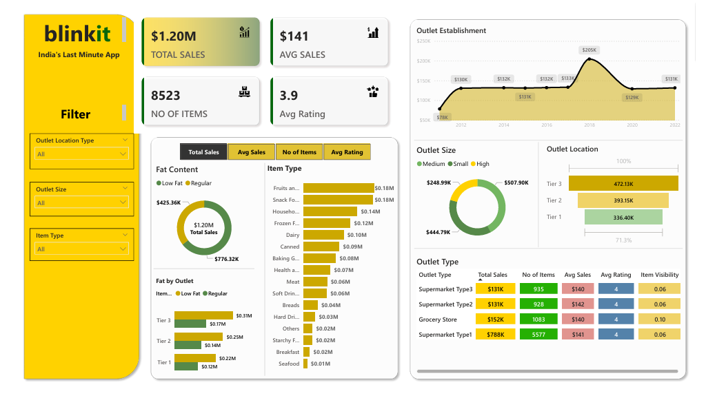

# Blinkit Sales Analytics

An end-to-end retail analytics case study combining **Python, PostgreSQL and Power BI** to examine product, outlet and rating performance across 8,523 records.



## Business objective

The project evaluates how sales vary by item category, fat-content category, outlet type, outlet tier, outlet size and establishment year. It is designed to help a retail reporting team identify the segments contributing most strongly to recorded sales and create a repeatable KPI-reporting workflow.

## Questions answered

1. What are total sales, average sales, record count and average rating?
2. Which item types contribute the most sales?
3. How does performance vary between low-fat and regular items?
4. Which outlet types, sizes and location tiers contribute the most sales?
5. How do outlet establishment-year groups compare?
6. Which item types rank highest within each outlet tier?

## Key findings

- The dataset contains **8,523 records** and approximately **1.20 million sales units**.
- Average sales per record are **140.99**, and the average rating is **3.97**.
- **Fruits and Vegetables** is the highest-sales item type at approximately **178,124**, followed closely by **Snack Foods** at approximately **175,434**.
- **Supermarket Type1** contributes approximately **787,550**, or about **65.5%** of total recorded sales.
- Low-fat items represent **64.6%** of recorded sales. This largely reflects their greater record count; average sales are similar for low-fat and regular items.
- Tier 3 outlets contribute **39.3%** of recorded sales, compared with **32.7%** for Tier 2 and **28.0%** for Tier 1.
- Medium outlets contribute **42.3%** of recorded sales, the largest outlet-size share.

These findings are descriptive. Record volumes differ between groups, so total sales alone should not be interpreted as evidence that a category causes stronger performance.

## Deliverables

- Reproducible Python cleaning and analysis workflow
- Cleaned, SQL-friendly dataset
- PostgreSQL schema, indexes and analytical queries
- Power BI workbook and dashboard preview
- Exported KPI and aggregation tables
- Portfolio-ready charts
- Automated regression tests and GitHub Actions workflow

## Repository structure

```text
blinkit-sales-analytics/
|-- .github/workflows/python-tests.yml
|-- data/
|   |-- raw/blinkit_data.csv
|   |-- processed/blinkit_data_clean.csv
|   `-- README.md
|-- images/
|   |-- dashboard_preview.png
|   |-- sales_by_establishment_year.png
|   |-- sales_by_outlet_tier.png
|   `-- top_item_types.png
|-- outputs/
|   |-- kpi_summary.csv
|   |-- sales_by_item_type.csv
|   `-- sales_by_outlet_type.csv
|-- power-bi/
|   |-- Blinkit Data.xlsx
|   `-- blinkit_dashboard.pbix
|-- python/blinkit_analysis.py
|-- sql/
|   |-- schema.sql
|   `-- analysis_queries.sql
|-- tests/test_analysis.py
|-- .gitignore
|-- README.md
`-- requirements.txt
```

## Analytical workflow

1. Retain the original data unchanged in `data/raw`.
2. Validate required columns and convert names to snake_case.
3. Standardise inconsistent fat-content labels.
4. Convert numeric fields, handle missing outlet sizes and remove duplicates.
5. Export a clean dataset for PostgreSQL and Power BI.
6. Calculate KPIs and segment-level performance tables.
7. Create visual evidence and an interactive Power BI dashboard.
8. Validate key results using automated regression tests.

## Run the Python analysis

From the project root:

```bash
python -m venv .venv
```

Activate the environment on Windows:

```bash
.venv\Scripts\activate
```

Install the dependencies and run the workflow:

```bash
pip install -r requirements.txt
python python/blinkit_analysis.py
python -m unittest discover -s tests -v
```

The script creates the processed CSV, KPI tables and portfolio charts automatically.

## Run the PostgreSQL analysis

1. Run `sql/schema.sql` in PostgreSQL.
2. Import `data/processed/blinkit_data_clean.csv` into `blinkit_sales`.
3. Run `sql/analysis_queries.sql`.

Example import command from `psql`:

```sql
\copy blinkit_sales FROM 'data/processed/blinkit_data_clean.csv' WITH (FORMAT csv, HEADER true);
```

The SQL analysis includes CTEs, conditional aggregation, percentage contribution and window-function rankings.

## Power BI dashboard

Open `power-bi/blinkit_dashboard.pbix` using Power BI Desktop. The original Excel source is included beside the workbook to support refresh and review.

## Technologies

- Python, Pandas, Matplotlib and Seaborn
- PostgreSQL and SQL
- Power BI and Excel
- GitHub Actions and `unittest`

## Data quality and limitations

- The original provider and licence were not documented in the earlier project. The dataset is therefore retained for educational portfolio use and should not be treated as official Blinkit company data.
- The sales field has no documented currency, so results are reported as dataset sales units rather than pounds, dollars or rupees.
- The data contains outlet establishment years, not transaction dates. It cannot support genuine monthly or annual sales-trend analysis.
- Customer identifiers, costs and profits are absent, preventing customer-level, margin and profitability analysis.
- The analysis identifies associations and descriptive differences, not causal relationships.

## Author

**Kavita Yadav** - MSc Advanced Computer Science, Queen Mary University of London

- [GitHub](https://github.com/kavita355321)
- [LinkedIn](https://www.linkedin.com/in/kavita6)
- [Email](mailto:kavita355321@gmail.com)

